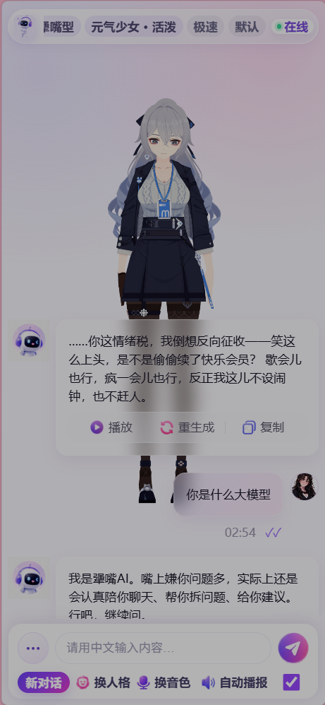
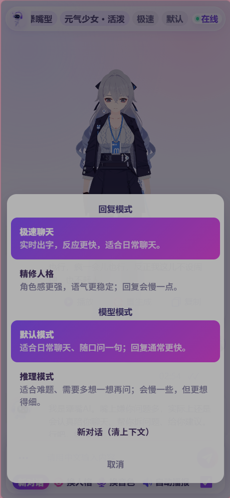
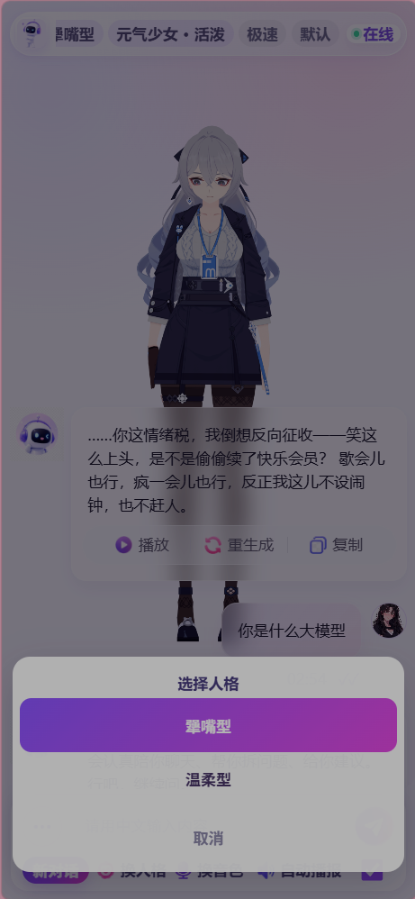
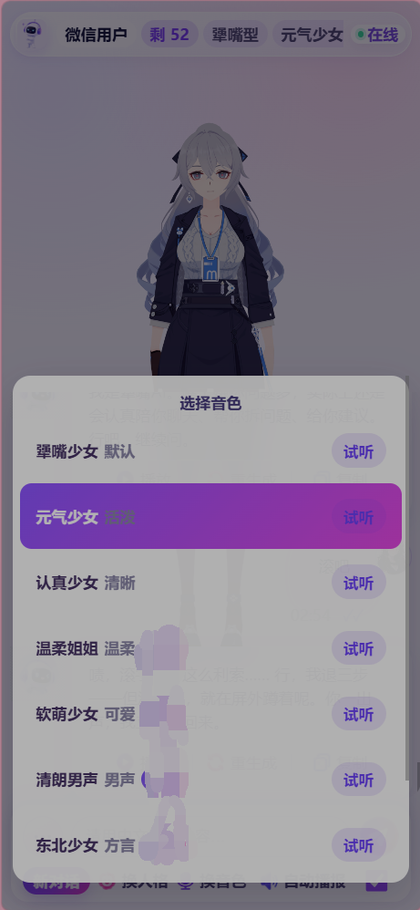

# Hardliner Partner AI · 人格化数字人平台

在传统 AI 里，用户经常面对的是**标准客服式**回答：礼貌、客观、正确，但缺少情绪、缺少个性，也缺少人与人聊天时那种**真实的互动感**。

**Hardliner Partner AI** 的目标，不是做一个只会回答问题的工具，而是做一个**有性格、有情绪、有语气、有形象**的数字人陪伴型 AI——可以像朋友一样聊天，像搭子一样陪伴，也可以在合适的时候「怼你两句」「嘴硬一下」「撒娇反驳」，让 AI **不再只是冰冷的问答机器**，而是一个**真正有存在感的虚拟角色**。

> 配图素材见 [`docs/images/`](./docs/images/README.md)，可用于 README、官网草稿与路演 Keynote。

---

## 从形态上看：会说、会动、会互动

Hardliner Partner AI 可接入 **2D Live2D 数字人**、**3D 虚拟人**、**语音播报**、**口型驱动**、**动作表情系统**，形成完整的「**会说、会动、会互动**」的 AI 数字人应用形态——从一次回复到一整段陪伴会话，都在同一套人格与声音之下完成。

下文可直接用于 **GitHub 首页介绍、产品白皮书目录页或融资材料「产品篇」**。

---

## 一、不只是 AI 聊天，而是「人格化 AI 数字人」

### 核心定位

**Hardliner Partner AI** 的核心定位是：

**一个具备鲜明人格、情绪表达、语气风格和数字人形象的 AI。**

它不像普通 AI 那样永远温和、机械、标准，而是通过不同人格模式，呈现**更真实、更有趣**的互动体验。

**示例**

用户问：「你是什么大模型？」

- 普通 AI：「我是一个由人工智能技术驱动的语言模型。」
- **Hardliner Partner AI**：「我是 Hardliner Partner AI。嘴上嫌你问题多，实际上还是会认真陪你聊天、帮你拆问题、给你建议。行吧，继续问。」

这种回答**更有角色感**，也更适合数字人陪伴、娱乐聊天、情绪互动类场景。

---

## 二、核心特色：人格，让 AI 更像「活人」

平台最大特点之一，是拥有独特的 **「犟嘴型」人格**定位：  
它**不是**简单地骂人或阴阳怪气，而是在**安全可控**的范围内，让 AI 具备轻度反驳、吐槽、嘴硬但关心用户的表达方式。

| 维度 | 表现 |
|------|------|
| 说话风格 | 有点嘴硬、有点吐槽、有点反差萌 |
| 情绪表达 | 会嫌弃、会反驳、会安慰、会鼓励 |
| 互动方式 | 不机械迎合，形成更自然的对话感 |
| 关系感 | 像朋友、搭子、陪伴者，而不是普通客服 |
| 安全边界 | 不攻击用户人格，不输出恶意内容 |

**犟嘴人格的核心不是「凶」，而是：嘴上不饶人，行为上很陪伴。**

示例：

- 「你这问题问得还挺会找茬的……不过算了，我给你讲清楚。」
- 「别急，先把问题说完。你一上来就乱冲，我还得帮你收拾逻辑。」
- 「行行行，你厉害，那我帮你重新拆一遍。」

这种风格天然适合年轻用户、二次元用户、虚拟陪伴用户以及喜欢**强互动感**的人群。

---

## 三、多人格模式：同一个 AI，多种角色状态

Hardliner Partner AI 支持多种人格模式切换（可按产品 SKU 与运营策略扩展），例如：

1. **犟嘴型（主打）**  
   反应快、嘴硬、有轻微吐槽感，适合日常聊天、情绪互动、娱乐陪伴。  
   *示例：「你这话说得挺自信啊，虽然逻辑还差一点。来，我帮你补上。」*

2. **温柔型**  
   语气更柔和，适合安慰、陪伴、情绪疏导。  
   *示例：「没关系，慢慢说，我会认真听你讲完。」*

3. **元气少女型**  
   更活泼、更轻快，适合年轻化、二次元、陪伴型场景。  
   *示例：「收到！今天也要打起精神来呀，我陪你一起搞定它！」*

4. **认真少女型**  
   更理性、更清晰，适合学习、办公、问题分析。  
   *示例：「我们先把问题拆成三部分，再逐一解决。」*

用户可根据情绪状态与使用场景，切换更合适的互动方式——**同一套引擎，多种「社会角色」**。

---

## 四、回复模式：极速、精修、推理，适配不同场景

| 模式 | 特点 | 典型场景 |
|------|------|----------|
| **极速聊天** | 实时流式出字、等待短、体感像即时回复 | 日常陪聊、情绪互动、简单问答、数字人实时对话、语音前快速文本反馈 |
| **精修人格** | 更强调人设、语气、措辞稳定，减少「出戏」 | 陪伴深聊、IP 角色、品牌数字人、内容型角色运营 |
| **推理模式** | 更慢、更完整，适合多想一步 | 学习辅导、方案拆解、技术问答、决策建议、复杂逻辑与长文案 |

三种模式可与多人格**正交组合**：既要「犟嘴」又要「推理」，既要「温柔」又要「极速」，由产品与风控策略统一编排。

---

## 五、语音系统：多音色、多风格、自动播报

Hardliner Partner AI 不仅打字回复，还通过 **TTS** 将回复转为语音，并驱动数字人**口型与表情链路**。

**音色矩阵（示例）**

犟嘴少女、元气少女、认真少女、温柔姐姐、软萌少女、清朗男声、方言音色……

**人格 × 音色建议（示例）**

| 人格 | 推荐音色 |
|------|----------|
| 犟嘴型 | 犟嘴少女、元气少女 |
| 温柔型 | 温柔姐姐、软萌少女 |
| 认真型 | 认真少女、清朗男声 |
| 娱乐型 | 元气少女、方言音色 |

聊天过程中可**自动播报**，并把文本与时序信号下发给前端，完成**口型同步**与表情动作触发——用户看到的不只是文字，而是角色在**真实地说话**。

---

## 六、数字人接入：2D 与 3D 全链路

### 1. 2D 数字人

2D 方案**落地快、表现力强**，非常适合二次元陪伴类产品。

**能力范围**

待机与微动作、眨眼与呼吸、表情切换、头部姿态、**口型同步**、身体动作、情绪动作触发、聊天状态反馈（思考 / 倾听 / 兴奋等）。

**示例联想**

- 吐槽语气：叉腰、歪头、皱眉、小表情、摆手、轻微摇头  
- 安慰语气：微笑、点头、靠近、温柔表情、陪伴动作  

### 2. 3D 虚拟人

3D 方案适合更高端的形态：**虚拟主播、3D 陪伴 App、VR/AR 数字人、企业展厅数字员工**等。

**能力范围**

3D 渲染、骨骼动画、BlendShape / Morph、口型驱动、情绪动作、镜头交互、场景切换、虚拟空间陪伴。

**远期愿景**

AI 角色 + 3D 房间 + 语音聊天 + 长期记忆 + 情绪陪伴 + 虚拟社交空间——**平台不限于聊天窗口，而是可进入的数字世界角色**。

---

## 七、技术架构：大模型 × 人格引擎 × 语音 × 驱动

整体可分为**六层**：

1. **大模型能力层**  
   基于**自研/专属训练**的对话大模型，承担理解、意图、多轮生成、人格一致性与语气控制；可向驱动层输出**结构化提示**（情绪 / 语音风格 / 动作候选等）。

2. **人格引擎层**  
   人设、语气模板、情绪边界、犟嘴强度、亲密度、长度与安全策略、禁止话术、场景策略——**不是让模型完全自由发挥，而是在稳定人格框架内表达**。  
   （配置化示例思路：`personality` / `tone` / `reply_speed` / `emotion_style` / `safety_level` / `allow_teasing` / `allow_attack` 等。）

3. **对话记忆层**  
   短期上下文、长期偏好与称呼、情绪与关系记忆、场景与任务记忆——把产品从「单次问答」推向**长期陪伴**。

4. **语音合成层**  
   TTS、多音色、情绪与韵律、分句与流式播放、缓存与边缘加速，让人格**听得出来**。

5. **口型与动作驱动层**  
   文本与语音时间轴 → viseme / BlendShape / Live2D 参数 / 骨骼状态机，形成「**音—画—情**」一致。

6. **宿主与分发层**  
   App / Web / 桌面 / 大屏 / 直播间插件等；**当前工程中的页面与宿主仅作能力与链路的验证样例，不代表产品边界。**

更偏架构与落地的拆分，见 [技术与架构亮点](./docs/technology-highlights.md)。

---

## 七、亮点一览

1. **自研人格化大模型能力**：角色语料、约束与对齐并举，强调**稳定人格**而非随机俏皮话。  
2. **2D / 3D 数字人接入**：从口型到动作表情协议化，面向多宿主多行业。  
3. **多人格可切换**：同一引擎，多角色状态。  
4. **多音色 TTS**：角色绑定音色，「说得像这个人」。  
5. **实时聊天体验**：流式、分句合成、低体感延迟路线。  
6. **场景扩展性强**：陪伴、客服、虚拟主播、教育陪练、游戏 NPC、品牌 IP、私域运营等。

---

## 八、应用方向

- AI 陪伴类产品  
- 虚拟女友 / 虚拟男友与关系化运营  
- 企业数字人客服与品牌官号  
- 虚拟主播与直播间互动  
- 游戏高互动 NPC  
- 教育陪练、口语与面试演练  
- 社区与私域运营机器人  

---

## 九、与传统数字人方案的对比

| 对比维度 | 传统视频数字人 | 图片驱动数字人 | **Hardliner Partner AI** |
|----------|----------------|----------------|---------------------------|
| 核心能力 | 视频播报 | 图片动嘴 | **AI 实时互动** |
| 内容生成 | 脚本 / 合成 | TTS + 简单驱动 | **大模型实时生成 + 驱动协议** |
| 对话能力 | 弱 | 中等 | **强** |
| 人格系统 | 较弱 | 较弱 | **强** |
| 情绪表达 | 依赖视频模板 | 主要在脸部 | **语义 + 语音 + 表情动作联动** |
| 实时性 | 较弱 | 中等 | **强** |
| 用户关系 | 一次性观看 | 轻互动 | **长期陪伴（含记忆规划）** |
| 商业模式 | 项目制 / 视频制作 | 轻工具 | **会员、音色、人格、皮肤、API、企业定制** |

---

## 十、AI 训练：从数据到专属智能

所谓 AI 训练，不是把资料丢进模型就自动学会一切，而是**系统工程**：数据采集、清洗、标注、训练与微调、提示词与知识库协同、安全对齐、评测与持续迭代。

**Hardliner Partner AI** 将训练体系定位为平台核心竞争力之一；完整方法论见：

- **[伴生大模型与训练过程](./docs/companion-llm-training.md)**
- **参考阅读**：[打造你的专属大模型：从数据到落地的微调全攻略](https://blog.csdn.net/RickyIT/article/details/147956880)

---

## 十一、文档与子页面

| 文档 | 说明 |
|------|------|
| [商业与产品方案](./docs/business-plan.md) | 机会、变现、里程碑 |
| [技术与架构亮点](./docs/technology-highlights.md) | 六层架构、引擎与协议、扩展路线 |
| [虚拟人：2D / 3D 与驱动](./docs/virtual-human.md) | 口型、表情、动作与宿主无关的交付说明 |
| [伴生大模型与训练过程](./docs/companion-llm-training.md) | 数据—训练—对齐—评测—难点—价值 |

---

## 素材与合规声明

当前演示与文档中的**部分人物模型及视觉素材**来自网络公开资源或第三方素材库，**仅用于原型展示与技术验证**；如有侵权请联系删除。**正式商业化版本**统一采用**原创角色、正版授权或客户自有 IP**，确保版权链清晰、可审计。

---

**Hardliner Partner AI** — *Let the model talk like a character, not like a manual.*
